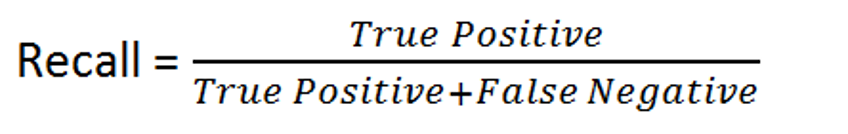
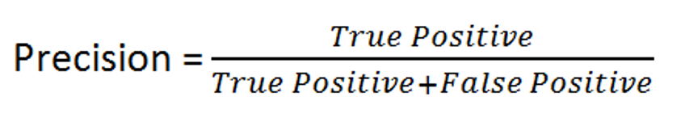

# Breast Cancer Detector

## Domain Background

"EsSalud Ilo" is a hospital located in Ilo, Moquegua which provides a range of health services to the people in that city. It has around 70,000 people affiliated to the hospital which is mostly finance by the government (from taxes). Carmen is currently the manager of "EsSalud Ilo" and is trying to adopt an AI strategy in order to reduce costs and reduce diagnostics time. 

The death rate in Ilo due to breast cancer is around 17%. This happends due to the lack of doctors on the region and therefore not having doctors to diagnose early breast cancer on women. Carmen has recently read that some universities in the United States have built breast cancer detectors which accuracy is higher than doctors trained at Standford University. Therefore, she has decided to invest money on building one breast cancer detector. She has talked to different hospital managers from other cities of Peru and they have agreed upon collecting data from different cells and label them as benign or malicious. After 1 month of instensive work, they have collected 699 samples and has sent it to a ML engineer to build the classifier. 

## Problem Statement

The goal of this project is to build a machine learning model capable of detecting whether a cell is benign (no cancer) or malicious (cancer).

## Metrics

For this problem, the **recall** metric, also known as **sensitivity**, will be used. Recall is the ratio between correctly classified malicious cells and the total actual number of malicious cells. The reason why we use this metric is because we want to reduce as much as we can the False Negatives (telling women they do not have malicious cells -cancer- when they actually do). Our goal is to have a recall of 95%.



The second metric to take into consideration is **precision**. Precision is the ratio between correctly classified malicious cell and the number of cells classified as malicious. The reason why we need to also take into consideration this metric is because we do not want to waste money given treatment to women who are healthy since the cost of giving them treatment is between $20,000 and $100,000. Our goal is to achieve an accuracy of 90%.



## Datasets & Inputs
The Breast Cancer dataset was pulled from the University of California Irvine’s machine learning repository. The dataset holds 699 entries. The columns are as following:

* `id`: Shows a unique identifier for a cell of a unique person. They are of `str` value. This column will be dropped since it does not give         any useful information for the classification task.
* `clump_thickness`: Values are on the range of 1 and 10. Values are `int` type.
* `uniform_cell_size`: Values are on the range of 1 and 10. Values are `int` type.
* `uniform_cell_shape`: Values are on the range of 1 and 10. Values are `int` type.
* `marginal_adhesion`: Values are on the range of 1 and 10. Values are `int` type.
* `single_epithelial_size`: Values are on the range of 1 and 10. Values are `int` type.
* `bare_nuclei`: Values are on the range of 1 and 10. Values are `int` type. This column has 16 missing values.
* `bland_chromatin`: Values are on the range of 1 and 10. Values are `int` type.
* `normal_nucleoli`: Values are on the range of 1 and 10. Values are `int` type.
* `mitoses`: Values are on the range of 1 and 10. Values are `int` type.
* `class`:  This is a categorical feature. 2 stands for benign cell and 4 stands for malicious cell.

**Notes:**

- The data is unbalanced. 65% of the dataset belongs to class 2 (benign) and 35% of the dataset belongs to class 4 (malicious).
- Most features are right-skewed except for the clump_thickness feature which is the closest of all features to a normal distribution. 
- The correlation between `uniform_cell_size` and `uniform_cell_shape` is 0.9.

## Building Models

3 models were used to build the classifier. K-Nearest Neighbours, Logistic Regression and Support Vector Machines.  

Models with best performance were:

```python

KNeighborsClassifier(algorithm='brute', leaf_size=30, metric='minkowski',
                     metric_params=None, n_jobs=None, n_neighbors=7, p=2,
                     weights='uniform')
                     
LogisticRegression(C=1.0, class_weight={2: 1, 4: 2}, dual=False,
                   fit_intercept=True, intercept_scaling=1, l1_ratio=None,
                   max_iter=100, multi_class='auto', n_jobs=None,
                   penalty='none', random_state=101096, solver='lbfgs',
                   tol=0.0001, verbose=0, warm_start=False)
                   # -> With a threshold of 0.8

SVC(C=10, break_ties=False, cache_size=200, class_weight={2: 2, 4: 1},
    coef0=0.0, decision_function_shape='ovr', degree=3, gamma=0.001,
    kernel='sigmoid', max_iter=-1, probability=False, random_state=101096,
    shrinking=True, tol=0.001, verbose=False)
```

* Recall for the K-Nearest Neighbours model was 0.96 and the precision was 0.96.
* Recall for the Logistic Regresion model was 0.98 and the precision was 0.89.
* Recall for the Support Vector Classifier model was 0.96 and the precision was 0.96.

These are the results for the validation set:

* Recall for the K-Nearest Neighbours model was 0.96 and the precision was 0.94.
* Recall for the Logistic Regresion model was 0.98 and the precision was 0.92.
* Recall for the Support Vector Classifier model was 0.94 and the precision was 0.94.

## Conclusion

Although all algorithms meet the requirements stated at the beginning, the model choosen for deployment will be the Logistic Regression because it has the highest recall score. Furthermore, Logistic Regression is the best model for explainable AI (feature importance) since model needs to be explained to people who regulate this technology.

## Future Work

Feature scaling could be done. For example a log transformation or a cox-box transformation. Also, upsampling techniques could be applied to balance the dataset. Finally, other ensemble techniques could be use such as a voting classifier or random forest or other boosting techniques such as AdaBoost, GradientBoost or XGboost.
 


