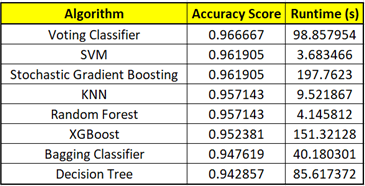

# breast-cancer-detector

This project aims to find the most efficient algorithm to detect breast cancer on patients. In order to do so, a comparison between different algorithms on their runtime values and accuracy scores was done. 

The Breast Cancer dataset was pulled from the University of California Irvine’s machine learning repository. Each row represents a cell. Different features such as clump thickness, bare nuclei, marginal adhesion, and others were selected since they are important properties for a pathologist to determine whether a cell is malignant (class = 4) or benign (class = 2).  

The following algorithms were used: k-Nearest Neighbors, SVM, Decision Trees, Voting Classifier, Bagging, Random Forest, AdaBoost, Gradient Boosting, XGBoost. GridSearchCV was used to find the best hyperparameters for the different algorithms.

A summary of the accuracy scores and runtime values for different algorithms is shown below:

**Conclusion:** The top 3 algorithms were Voting Classifier, SVM, and Stochastic Gradient Boosting with accuracy scores of 0.967, 0.962 and 0.962, respectively. However, among those 3 algorithms, the fastest was SVM with a runtime of 3.68 seconds. Therefore, it can be concluded that the most efficient algorithm was the SVM.

**Note:** Ensemble methods such as XGBoost or Random Forest (and others) are known in industry to outperform algorithms such as SVM, k-NN and Decision Trees. However, during this project, not many values were used during hyperparameter tuning since it can take long time. Therefore, there is a high probability that ensemble methods used in this project can outperform the SVM if we add more values in the GridSearch. Further investigation needs to be done. Furthermore, a discussion with a Breast Cancer Specialist needs to be conducted to see if 0.96 is a good accuracy score or an improvement needs to be done.

